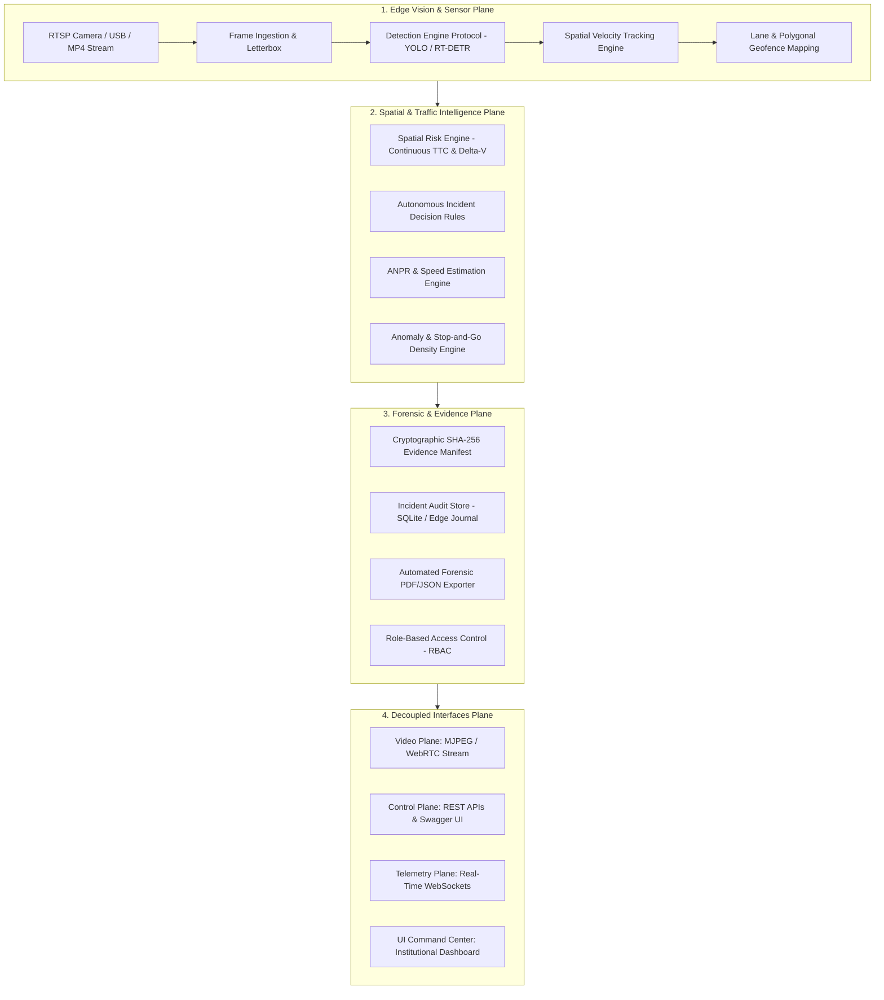

# ArgusTraffic AI — Enterprise System Architecture & Specification

## 1. High-Level Vision & Purpose
**ArgusTraffic AI** is an industrial-grade, edge-native Intelligent Transportation Systems (ITS) platform that converts video sensor streams into real-time spatial telemetry, automated incident detection, multi-signal risk assessments, and forensic evidence packages.

---

## 2. Layered Domain Architecture

---

## 3. Core Protocols & Design Principles

The platform strictly enforces the **Dependency Inversion Principle (DIP)**:

- `DetectionEngine` ([`src/core/interfaces.py`](file:///c:/Users/rampa/Downloads/New%20folder%20(19)/src/core/interfaces.py)): Decouples object detection from specific deep-learning frameworks (PyTorch, ONNX Runtime, TensorRT).
- `TrackingEngine` ([`src/core/interfaces.py`](file:///c:/Users/rampa/Downloads/New%20folder%20(19)/src/core/interfaces.py)): Isolates multi-object association and Kalman filtering from vision inputs.
- `RiskEngineProtocol` ([`src/core/interfaces.py`](file:///c:/Users/rampa/Downloads/New%20folder%20(19)/src/core/interfaces.py)): Evaluates mathematical Time-to-Collision (TTC) and proximity vectors independently of downstream notification adapters.
- `PlatformConfig` ([`src/core/config_schema.py`](file:///c:/Users/rampa/Downloads/New%20folder%20(19)/src/core/config_schema.py)): Strongly-typed Pydantic settings ensuring zero hardcoded magic numbers.

---

## 4. Architectural Decision Records (ADRs)
- [ADR 0001: Domain-Driven Architecture, Dependency Inversion, and Protocol Interfaces](docs/adr/0001-domain-driven-architecture-and-protocols.md)
- [ADR 0002: Cryptographic Forensic Evidence Manifest and ANPR Privacy Lifecycle](docs/adr/0002-cryptographic-evidence-and-privacy-lifecycle.md)
