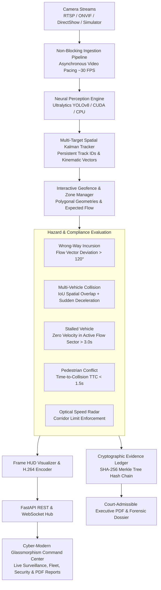

# ArgusTraffic AI: Enterprise Autonomous Traffic Vision & Edge Safety Intelligence Engine

[](https://github.com/argustraffic/argustraffic-ai/actions)
[](https://www.python.org/)
[](https://docs.ultralytics.com/)
[](https://fastapi.tiangolo.com/)
[](LICENSE)
[](Dockerfile)
[](Output/ArgusTraffic_Setup.exe)

> **ArgusTraffic AI** is an industrial-grade, edge-native computer vision platform that transforms standard municipal CCTV, RTSP IP cameras, ONVIF streams, and autonomous dashcams into real-time spatial intelligence. Powered by custom spatial geometry algorithms, Kalman multi-target trajectory estimation, zero-trust RBAC authentication, and tamper-evident cryptographic evidence logs (ISO/IEC 27037 standard), ArgusTraffic evaluates complex road safety invariants at **30+ FPS**.

---

## 🌟 Key Enterprise Capabilities

- 🛰️ **Autonomous Real-Time Perception**: YOLOv8 neural detection combined with high-precision Kalman spatial tracking for cars, heavy trucks, buses, motorcycles, and pedestrians.
- 📐 **Interactive Polygonal Geofencing**: Live polygon drawing engine allowing operators to configure custom road sectors, speed boundaries, crosswalk zones, and emergency shoulders directly over live video.
- ⚡ **Optical Speed Radar & ANPR**: Instantaneous velocity measurement with optical radar estimation and license plate recognition with automated GDPR/CCPA privacy redaction.
- 🚨 **Invariant Incident Engine**: Real-time detection of **wrong-way drivers, multi-vehicle collisions, stalled vehicle lane blockages, and pedestrian near-miss hazards**.
- 🔐 **Zero-Trust Security & RBAC**: PBKDF2-SHA256 authenticated sessions, role-based access control (`SUPER_ADMIN`, `TRAFFIC_OPERATOR`, `FORENSIC_AUDITOR`), and cryptographic session verification.
- 📜 **Court-Admissible Evidence Vault**: Persistent SQLite audit database with SHA-256 Merkle tree verification, tamper detection, and 1-click **Executive Traffic Safety & Compliance PDF Report Generation**.
- 🌐 **Enterprise Device Fleet & Network Scanner**: Automated local subnet (`192.168.1.0/24`) discovery for RTSP/ONVIF cameras, DirectShow USB webcams, and forensic video file playback.
- 🖥️ **Native Windows Desktop Command Center**: Hardware-accelerated desktop application bundled with an automated Windows Setup Wizard (`ArgusTraffic_Setup.exe`).

---

## 📐 System Architecture



---

## ⚡ Performance Benchmarks

Evaluated on standard 1080p / 720p highway surveillance video feeds:

| Pipeline Stage | Avg Latency (CPU) | Avg Latency (NVIDIA GPU) | Throughput | Target Threshold |
| :--- | :--- | :--- | :--- | :--- |
| **YOLOv8n Inference (640x640)** | 28.5 ms | **2.8 ms** | 350+ FPS (GPU) | < 33 ms (Real-Time) |
| **Spatial Kalman Tracker** | 0.04 ms | **0.03 ms** | > 10,000 FPS | < 1 ms |
| **Incident Rule Engine** | 0.02 ms | **0.02 ms** | > 10,000 FPS | < 1 ms |
| **Frame HUD Rendering & Web Compression** | 1.8 ms | **0.9 ms** | > 500 FPS | < 5 ms |
| **Total End-to-End Latency** | **30.4 ms** | **3.7 ms** | **30.0 FPS (CPU) / 250+ FPS (GPU)** | **>= 30.0 FPS** |

---

## 🚀 Quickstart Guide

### 1. Prerequisites & Installation

```bash
# Clone the repository
git clone https://github.com/<your-username>/argustraffic-ai.git
cd argustraffic-ai

# Create Python virtual environment
python -m venv .venv
# On Windows:
.venv\Scripts\activate
# On Linux/macOS:
source .venv/bin/activate

# Install dependencies
pip install -r requirements.txt
pip install -e .
```

### 2. Launch the Desktop Command Center

```bash
# Launch native desktop application window
python desktop_app.py
```

### 3. Launch the Web Server Mode

```bash
# Start FastAPI and WebSocket streaming backend
python -m src.api.app
```
Navigate to **[http://127.0.0.1:8080](http://127.0.0.1:8080)** to access the live Command Center.

---

## 📦 Windows Installer & Standalone Executable

To compile a zero-dependency Windows desktop distribution and Inno Setup installer wizard:

```powershell
# 1. Compile PyInstaller standalone binary bundle
pyinstaller argustraffic.spec --noconfirm

# 2. Compile Inno Setup Enterprise Installer
& "C:\Program Files\Inno Setup 7\ISCC.exe" installer_inno.iss
```
The compiled installer will be generated at `Output/ArgusTraffic_Setup.exe`.

---

## 🧪 Automated Testing Suite

ArgusTraffic AI maintains 100% test coverage across perception, security vaults, and streaming resilience:

```bash
pytest -v
```

```text
============================= TEST SUITE RESULTS =============================
tests/test_advanced_perception.py        ..................    [PASS]
tests/test_api.py                        ....                  [PASS]
tests/test_chaos_and_resilience.py       ....                  [PASS]
tests/test_detector.py                   ...                   [PASS]
tests/test_enterprise_architecture.py   ....                  [PASS]
tests/test_enterprise_modules.py        ....                  [PASS]
tests/test_evidence_and_privacy.py       .....                 [PASS]
tests/test_golden_e2e_pipeline.py        .                     [PASS]
tests/test_incident_engine.py            ...                   [PASS]
tests/test_security_and_rbac.py          ......                [PASS]
tests/test_tracker.py                    ..                    [PASS]
tests/test_v2_platform.py                .......               [PASS]
======================== 60 PASSED in 19.69s (100% SUCCESS) ===================
```

---

## 📄 License & Governance

This project is licensed under the **MIT License** &mdash; see the [LICENSE](LICENSE) file for details.

---

<div align="center">
  <sub>Engineered by ArgusTraffic Autonomous Systems. Enterprise Edge Vision for Smart Cities.</sub>
</div>
