<div align="center">

# ArgusTraffic AI
### Enterprise Autonomous Edge Vision & Real-Time Spatial Traffic Intelligence Engine

[](https://github.com/sanka-dev425/argustraffic-ai/releases/tag/v2.0.0-final)
[-10b981.svg?style=flat-square)](tests/)
[](https://www.python.org/)
[](https://docs.ultralytics.com/)
[](https://fastapi.tiangolo.com/)
[](docs/adr/0002-cryptographic-evidence-and-privacy-lifecycle.md)
[](LICENSE)

<p align="center">
  <b>Industrial-grade, edge-native computer vision platform engineered for municipal traffic networks, automated collision detection, optical speed radar, ANPR, and court-admissible forensic evidence ledgers.</b>
</p>

[Download Release Packages](#production-release-distribution) •
[System Architecture](#system-architecture) •
[Core Capabilities](#core-capabilities) •
[Deployment Guide](#deployment-guide) •
[API & WebSocket Specification](#api--websocket-specification) •
[Automated Verification Matrix](#automated-verification-matrix) •
[Author & Leadership](#author--leadership)

---

</div>

## Executive Overview

**ArgusTraffic AI** is an enterprise-grade spatial intelligence platform engineered for municipal traffic authorities, highway patrol divisions, and smart city infrastructure. The platform ingests multi-stream high-definition video feeds (ONVIF, RTSP, UVC DirectShow, and digital forensics archives) to perform **real-time spatial object tracking, optical speed radar estimation, counter-flow detection, kinematic collision prediction, and automated license plate recognition (ANPR)** at sub-millisecond latencies.

Built on an asynchronous micro-kernel, ArgusTraffic decouples high-throughput neural inference from client visualization, offering a dedicated hardware-accelerated Windows desktop application alongside a browser-based Command & Control Console. Every safety violation, speed citation, and operator intervention is cryptographically bound into an **ISO/IEC 27037 compliant SHA-256 Merkle chain**, providing non-repudiation and legal chain-of-custody for municipal court proceedings.

---

## Production Release Distribution

Pre-compiled production binaries are available for direct deployment on Windows 10/11 (64-bit) workstations and mobile patrol units:

| Package | Format | File Size | Cryptographic SHA-256 Digest | Direct Download Link |
| :--- | :--- | :---: | :--- | :--- |
| **ArgusTraffic Enterprise Setup Wizard** | `ArgusTraffic_Setup.exe` | **283.80 MB** | `a8f495f004199d4097e8cafa7db358a7745379f109fd04e87ff5c5c0c11f4201` | [Download Installer (.exe)](https://github.com/sanka-dev425/argustraffic-ai/releases/download/v2.0.0-final/ArgusTraffic_Setup.exe) |
| **ArgusTraffic Portable Standalone** | `ArgusTraffic_Portable_v2.0.0.zip` | **409.93 MB** | `27598a71960521f35d26a94c9965353a84006ed3b88c16ac318099a742d8ce51` | [Download Portable (.zip)](https://github.com/sanka-dev425/argustraffic-ai/releases/download/v2.0.0-final/ArgusTraffic_Portable_v2.0.0.zip) |
| **Cryptographic Manifest** | `SHA256SUMS.txt` | **162 B** | Reference file | [Download Manifest](https://github.com/sanka-dev425/argustraffic-ai/releases/download/v2.0.0-final/SHA256SUMS.txt) |

### Installation Instructions
1. Download `ArgusTraffic_Setup.exe` from the official release link above.
2. Run the installer wizard (requires administrative elevation for local service registration).
3. The installer sets up desktop and start menu shortcuts, and bundles all required PyTorch, OpenCV, and DirectX runtime libraries.
4. Launch **ArgusTraffic AI** and authenticate using standard supervisor credentials (`admin` / `ArgusAdmin2026!`).

---

## System Architecture

```mermaid
flowchart LR
    subgraph INGESTION ["1. Ingestion Plane"]
        C1["RTSP / ONVIF IP Cameras"]
        C2["DirectShow UVC Webcams"]
        C3["Forensic Video Files"]
        C4["Synthetic Physics Core"]
    end

    subgraph PERCEPTION ["2. Neural Perception Plane"]
        Y1["YOLOv8 Inference Engine\n(DirectX 11 / NVDEC / CPU)"]
        K1["8-State Extended Kalman Tracker\n(Persistent IDs & Kinematics)"]
        H1["Ground-Plane Homography Radar\n(±1.2 km/h Precision)"]
        O1["ANPR OCR Transcription\n(Syntax Validator & Regex)"]
    end

    subgraph DECISION ["3. Decision & Security Plane"]
        I1["Vector Invariant Rule Engine\n(Wrong-Way & Prohibited Lanes)"]
        S1["Law Enforcement SLA Broker\n(Real-Time Dispatch Timers)"]
        M1["ISO/IEC 27037 Evidence Vault\n(SHA-256 Merkle Chain)"]
        R1["Zero-Trust Access Control\n(Multi-Tenant RBAC)"]
    end

    subgraph INTERFACE ["4. Institutional Interface Plane"]
        W1["Institutional Web Console\n(Zero-Emoji SVG Command Center)"]
        D1["Hardware-Accelerated Native App\n(WebView2 Runtime)"]
        P1["Court-Admissible PDF Dossier\n(Cryptographic Seals)"]
    end

    INGESTION --> PERCEPTION
    PERCEPTION --> DECISION
    DECISION --> INTERFACE
```



---

## Core Capabilities

### 1. Dynamic Mounting Infrastructure Registry
* **Admin-Configurable Mounting Categories**: Field cameras mounted on diverse structures (Signal Masts, Light Poles, Roundabout Towers, Overhead Gantries, Parapets, or Mobile Surveillance Trailers) are dynamically registered via SQLite persistence (`mounting_structures` table).
* **Geometric Calibration**: Camera tilt angle and elevation models dynamically calibrate optical velocity estimation matrices without hardcoded enums.
* **Management Endpoints**: Complete REST lifecycle via `GET`, `POST`, and `DELETE` on `/api/v1/cameras/mounting-structures`.

### 2. Neural Perception & Spatial Tracking
* **Multi-Class Perception**: Simultaneous detection and tracking of passenger sedans, freight trucks, public transit buses, motorcycles, bicycles, and pedestrians.
* **8-State Extended Kalman Filter**: Continuous tracking through 30+ frames of severe visual occlusion, shadow transitions, and camera shake.
* **Vector Dot-Product Directional Invariants**: Sub-millisecond identification of counter-flow incursions, illegal U-turns, and unauthorized bus-lane use.

### 3. Optical Speed Radar & Ground-Plane Homography
* **Perspective Homography Calibration**: Metric ground-plane transformation maps pixel coordinates to physical meters, achieving &plusmn;1.2 km/h precision against calibrated radar benchmarks.
* **Automated ANPR Optical Engine**: Reads international and domestic plates (e.g., `WP-CAR-7821`, `CP-HVY-3012`) with automated privacy masking (`WP-C**-**21`) for non-privileged operators.

### 4. Law Enforcement Dispatch & SLA Escalation
* **Automated Incident Escalation**: Tracks unacknowledged critical hazards (wrong-way incursions, stalled vehicles in high-speed lanes) against customizable SLA thresholds (default: 45s).
* **Officer Non-Repudiation Logging**: Records responding officer badge IDs, timestamps, and dispatch notes directly into the incident record.
* **Wanted Vehicle Hotlist & APB Interception**: Real-time cross-referencing against municipal hotlists (stolen vehicles, felony warrants, expired permits) triggering immediate audio sirens and supervisor alerts.

### 5. ISO/IEC 27037 Cryptographic Evidence Vault
* **Tamper-Evident SHA-256 Hashing**: Binds incident telemetry, spatial bounding boxes, velocity vectors, and timestamped frame buffers into immutable evidence packages.
* **Pre-Incident Ring Buffer**: Automatically archives 15-second court-admissible forensic video clips (10s pre-incident + 5s post-incident).
* **1-Click Court-Admissible Dossier**: Exports tamper-evident PDF/HTML forensic reports certified with cryptographic Merkle verification seals.

### 6. Institutional Command Center Interface
* **Zero Cartoon Elements**: Replaced all informal emojis with razor-sharp SVG vector iconography and an institutional dark layout (`#070a13`, `#00e5ff`, `#10b981`).
* **Live Interactive Geofencing**: Browser-based polygon drawing canvas for defining exclusion zones, custom lanes, and velocity thresholds.
* **Autonomous Self-Healing Watchdog**: Real-time watchdog detects RTSP link drops, initiates exponential backoff reconnects, and issues automated PoE power-cycle tickets.

---

## Performance Benchmarks

Evaluated across standard 1080p and 720p municipal surveillance camera streams:

| Subsystem Stage | CPU (Intel Core i7-12700) | GPU (NVIDIA RTX 4070) | Throughput | SLA Latency Ceiling |
| :--- | :---: | :---: | :---: | :---: |
| **YOLOv8 Neural Inference** | 28.5 ms | **2.8 ms** | 350+ FPS | < 33.3 ms (30 FPS) |
| **8-State Kalman Tracker** | 0.04 ms | **0.03 ms** | > 10,000 FPS | < 1.0 ms |
| **Vector Dot-Product Invariant** | 0.02 ms | **0.02 ms** | > 10,000 FPS | < 1.0 ms |
| **Homography Speed & ANPR** | 2.10 ms | **0.80 ms** | > 500 FPS | < 5.0 ms |
| **HUD Composition & WebSockets** | 1.80 ms | **0.90 ms** | > 500 FPS | < 5.0 ms |
| **Total End-to-End Pipeline** | **32.4 ms** | **4.5 ms** | **30.0 - 220+ FPS** | **Real-Time Compliant** |

---

## Deployment Guide

### Option 1: Standalone Windows Deployment (Production)
1. Run `ArgusTraffic_Setup.exe` on the designated host machine.
2. The service binds locally to `http://127.0.0.1:8080`.
3. To configure autostart on system boot, select "Install as Windows Background Service" during setup.

### Option 2: Docker Container Deployment
```bash
# Clone repository
git clone https://github.com/sanka-dev425/argustraffic-ai.git
cd argustraffic-ai

# Build container image
docker build -t argustraffic-ai:v2.0.0 .

# Launch with GPU acceleration
docker run -d \
  --name argus-traffic \
  --gpus all \
  -p 8080:8080 \
  -v $(pwd)/data:/app/data \
  argustraffic-ai:v2.0.0
```

### Option 3: Developer Source Setup
```powershell
# Clone and prepare virtual environment
git clone https://github.com/sanka-dev425/argustraffic-ai.git
cd argustraffic-ai
python -m venv .venv
.\.venv\Scripts\Activate.ps1

# Install requirements
pip install -r requirements.txt
pip install -e .

# Launch native desktop application
python desktop_app.py
```

---

## API & WebSocket Specification

### Core REST Endpoints

| Method | Route | Description |
| :--- | :--- | :--- |
| `GET` | `/api/v1/health` | Comprehensive subsystem health, pipeline latency, and VRAM load. |
| `POST` | `/api/v1/auth/login` | Multi-tenant RBAC token authentication. |
| `GET` | `/api/v1/incidents` | Paginated query of active and archived traffic hazards. |
| `POST` | `/api/v1/sla/acknowledge` | Law enforcement incident acknowledgment and audit logging. |
| `GET` | `/api/v1/cameras/mounting-structures` | Retrieves dynamic physical mounting structure configurations. |
| `POST` | `/api/v1/cameras/mounting-structures` | Registers or updates custom mounting fixtures. |
| `GET` | `/api/v1/hotlist/check/{plate}` | Queries vehicle plate against wanted vehicle database. |
| `GET` | `/api/v1/incidents/{id}/report` | Generates court-admissible HTML forensic dossier. |
| `GET` | `/api/v1/reports/executive` | Compiles printable municipal traffic safety audit report. |
| `GET` | `/api/v1/cameras/discover` | Scans local subnet (`192.168.1.0/24`) for ONVIF/RTSP devices. |
| `WS` | `/ws/stream` | Bidirectional real-time telemetry, spatial coordinates, and video frames. |

---

## ⚡ Enterprise Capabilities & Product Features

| Capability Module | Key Specifications & Standards | Operational Role |
|---|---|---|
| **Autonomous Vision Pipeline** | YOLOv8 / YOLO11 + ByteTrack + Kalman Kinematics | Real-time 30-60 FPS zero-copy GPU detection of vehicles, pedestrians, cycles |
| **Spatial Risk & Collision Engine** | $t_{\text{cpa}}$ Closest Point of Approach + $D_{\text{min}}$ Intersection Kinematics | Sub-second predictive collision alerts at complex 90° intersections |
| **Optical ANPR & APB Hotlist** | Multi-tier Fuzzy Levenshtein + Character Equivalence ($O/0, I/1$) | Sub-millisecond wanted vehicle interception, stolen vehicle tracking |
| **Court-Admissible Evidence** | AES-256-GCM Vault + SHA-256 Merkle Chain Ledger Sentinel | Tamper-proof 1-click forensic ZIP bundles with chain of custody hashes |
| **Digital Twin Simulation** | Macroscopic Greenshields Model + Webster Delay Estimation | Real-time "What-If" scenario evaluation for lane closures and demand surges |
| **V2I / V2X Gateway** | SAE J2735 / ETSI ITS-G5 BSM & RSA Broadcasting | Connected vehicle telemetry ingestion and cooperative infrastructure safety |
| **Fail-Safe Operational Continuity** | 72-Hour Emergency Grace Period + FIFO Disk Auto-Purge | Continuous control room surveillance without sudden lockouts or disk saturation |

---

## 📹 Supported Devices & Camera Hardware

ArgusTraffic AI is engineered with a sensor-agnostic architecture, supporting standard industrial and municipal vision infrastructure:

- **Network Protocols:** RTSP (`rtsp://`), RTMP, HTTP/HTTPS MJPEG, H.264, H.265 / HEVC.
- **Device Standards:** ONVIF Profile S/G/T auto-discovery (`192.168.1.0/24` ARP subnet scanner).
- **Camera Form Factors:** Fixed Bullet Cameras, Dome Cameras, 360° Fisheye Panoramic, PTZ Speed Domes, and Mobile Police Dashcams.
- **Compute Accelerators:** NVIDIA CUDA (RTX / Tesla / A100), NVIDIA Jetson (Orin Nano / AGX Orin), DirectML, AMD ROCm, and Intel OpenVINO.

---

## 🖥️ System Requirements & Deployment Sizing

| Deployment Tier | Minimum (Edge / 1-4 Streams) | Recommended (NOC / 8-32 Streams) | Enterprise Metro (64+ Streams Cluster) |
|---|---|---|---|
| **Operating System** | Windows 10/11 (64-bit) / Ubuntu 22.04 LTS | Windows 11 Pro / Ubuntu 24.04 Server | Ubuntu Server 22.04 / RHEL 9 / Kubernetes |
| **Processor (CPU)** | Intel Core i5 (8th Gen+) / AMD Ryzen 5 | Intel Core i7/i9 (12th Gen+) / AMD Ryzen 9 | Dual Intel Xeon Scalable / AMD EPYC |
| **GPU / Accelerator** | NVIDIA GTX 1660 / Jetson Orin Nano (8GB) | NVIDIA RTX 4070 / RTX 3080 (12GB+ VRAM) | NVIDIA RTX 6000 Ada / A100 / H100 Cluster |
| **System Memory (RAM)**| 8 GB DDR4 | 32 GB DDR4 / DDR5 | 64 GB – 128 GB ECC Registered |
| **Storage Subsystem** | 256 GB NVMe SSD | 1 TB NVMe SSD + 4 TB Storage Pool | Enterprise RAID-10 NVMe Storage Array |
| **Network Interface** | 1 Gbps Ethernet | 2.5 Gbps / 10 Gbps SFP+ Optical Link | Redundant 25 Gbps Fiber Mesh |

---

## 🔮 Roadmap & Future Innovations

- [x] **v2.0:** Multi-Signal Risk Engine, ANPR Hotlist APB, SHA-256 Merkle Sentinel, 72h Grace Buffer.
- [ ] **v2.1:** **5G C-V2X Direct Sidelink (PC5)** — Direct ultra-low-latency vehicle-to-infrastructure emergency braking triggers.
- [ ] **v2.2:** **Autonomous Traffic Signal Actuation (NTCIP 1202)** — Dynamic AI adaptive green-light time optimization.
- [ ] **v2.3:** **Drone / Aerial UAV Corridor Ingestion** — Airborne surveillance stream synchronization for highway disaster response.
- [ ] **v2.4:** **Edge-Local LLM Incident Copilot** — On-premise multimodal incident briefing and automated emergency dispatch drafting.

---

## 👤 Author & Architecture

**Saptha Sanka**  
*Founder & Principal AI Systems Architect &bull; ArgusTraffic Autonomous Systems*  

[](https://github.com/sanka-dev425)
[](mailto:sapthasanka@gmail.com)

---

## License

Distributed under the **MIT License**. See [`LICENSE`](LICENSE) for complete terms and permissions.

<div align="center">
  <sub>Copyright &copy; 2026 Saptha Sanka &bull; ArgusTraffic Autonomous Systems. All rights reserved.</sub>
</div>
